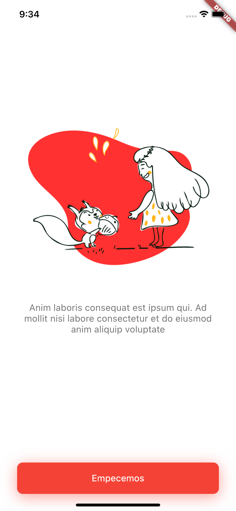

# Finance App Flutter

Finance App es una aplicación open source para el control de tus finanzas.

## Interacción de usuario y diseño

|  |  |  |
| ------------------------------------------------------------------------- | ------------------------------------------------------------------------- | ------------------------------------------------------------------------- |

[Finance App UI/UX](https://www.figma.com/file/g72TMxl6ORCx3r7a3U12lf/Finance-App-UX%2FUI?node-id=3%3A512)

## Instalación

Debes tener instalado Fluttter en tu maquina local. Para más información sobre como instalar, [aquí](https://flutter.io/docs/get-started/install).

```
git@github.com:Finance-App-Open-Source/finance-app-flutter.git
```

```
flutter pub get
```

```
flutter run
```

---
